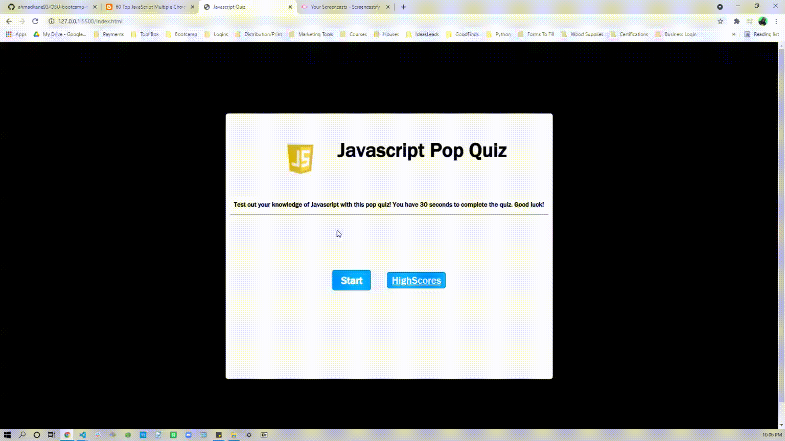

# OSU-bootcamp-quizapp

 
 
 
<h2> Description </h2>
<ul>
<li>The objective of this project was to create a functional quiz application.</li>
<li>This quiz app was formed by using different Javascript techniques such as strings and arrays.</li>
<li> This project taught me how to incorporate different functions to create an application.</li>
</ul>
 
 
 
<h2> Installation </h2>
https://github.com/ahmadkane93/OSU-bootcamp-quizapp
 
 
 
<h2> Usage </h2>
<li>Open the webpage.</li>
<li>Click on the start button.</li>
<li>Click on the correct answer to the best of your ability.</li>
<li>After finishing the quiz, type your name to be displayed in the highscores leaderboard.</li>
<li>After saving your name, you will be returned back to the main menu.</li>

 
 

 
 
 
<h2>Credit</h2>
<li>James Q Quick- https://www.youtube.com/playlist?list=PLDlWc9AfQBfZIkdVaOQXi1tizJeNJipEx
</li>
<li>Web Cifar- https://www.youtube.com/watch?v=_a4XCarxwr8&t=630s</li>
<li>Web Dev Simplified- https://www.youtube.com/watch?v=riDzcEQbX6k
</li>
<li>Emojipedia.org- https://emojipedia.org/</li>
<li>60 Top JavaScript Multiple Choice Questions and Answers- 
http://mcqspdfs.blogspot.com/2013/08/60-top-javascript-multiple-choice.html</li>
 
 
 
<h2>License</h2>

MIT License

Copyright (c) [2021] [Ahmad Kane]

Permission is hereby granted, free of charge, to any person obtaining a copy
of this software and associated documentation files (the "Software"), to deal
in the Software without restriction, including without limitation the rights
to use, copy, modify, merge, publish, distribute, sublicense, and/or sell
copies of the Software, and to permit persons to whom the Software is
furnished to do so, subject to the following conditions:

The above copyright notice and this permission notice shall be included in all
copies or substantial portions of the Software.

THE SOFTWARE IS PROVIDED "AS IS", WITHOUT WARRANTY OF ANY KIND, EXPRESS OR
IMPLIED, INCLUDING BUT NOT LIMITED TO THE WARRANTIES OF MERCHANTABILITY,
FITNESS FOR A PARTICULAR PURPOSE AND NONINFRINGEMENT. IN NO EVENT SHALL THE
AUTHORS OR COPYRIGHT HOLDERS BE LIABLE FOR ANY CLAIM, DAMAGES OR OTHER
LIABILITY, WHETHER IN AN ACTION OF CONTRACT, TORT OR OTHERWISE, ARISING FROM,
OUT OF OR IN CONNECTION WITH THE SOFTWARE OR THE USE OR OTHER DEALINGS IN THE
SOFTWARE.
 
 
 
